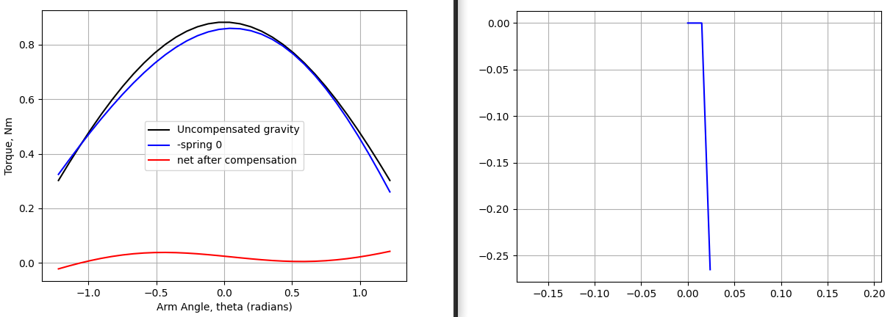
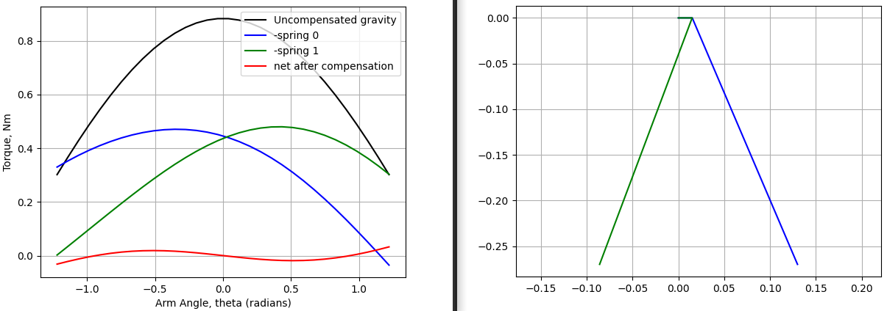

# Spring Virtual Counterweight
For very simple (1R) mechanisms, a spring-based "virtual counterweight" may be used to counteract gravity.

`spring_counterweight.py` contains the calculations. Some scenario constants must be changed in here.

`springs_english.csv` contains data on 1284 tension (extension) springs from the McMaster catalog. Units are meters for length, and newtons for force ("english" indicates the springs are listed as english in the McMaster catalog).

`survey.py` searches for the best arrangement of every spring in the `springs_english.csv` catalog, and writes successful solves to `solutions.csv`. 

Open `solutions.csv` as a spreadsheet to explore and filter the option space. A common trend among high-performing example solutions is small lever arms and highly negative `spring_origin_y`; high initial preload, relatively low change in spring length (relatively low spring force change). Conclusion: in the examples the torque curve is primarily driven by change in angle between the lever arm and the spring direction.

To see more about a solution of interest, use `check_one.py`.

This is quite slow (~4min for a full survey of 1300 springs x 2), I didn't bother to try and make it fast.

# Example Output Plots

